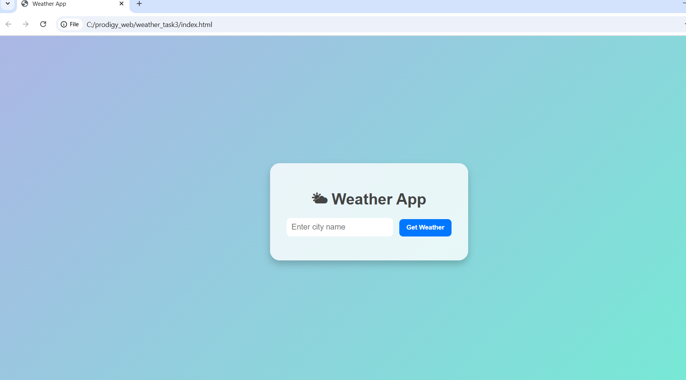
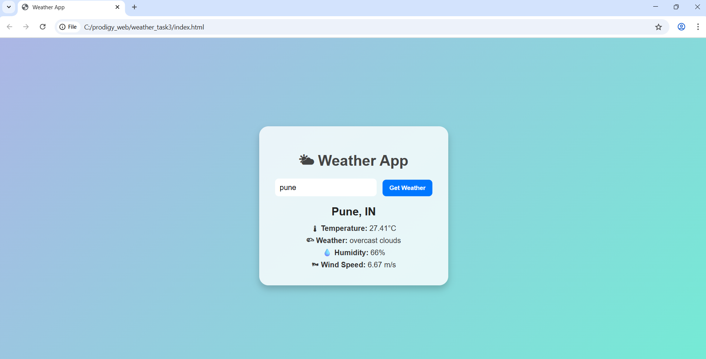

# 🌤 PRODIGY_WD_05 – Weather App  

👉 “A simple and interactive Weather App built with **HTML, CSS, and JavaScript**, fetching real-time weather data from the **OpenWeatherMap API**. Users can search weather by city or use their current location.”  

---

## 📌 Project Description  
This project is **Task-05** of my Web Development Internship at **Prodigy InfoTech**.  
It’s a **Weather Application** where users can:  
- Get real-time weather data for any city  
- Fetch live weather details using their current location  
- View temperature, humidity, wind speed, and weather condition  

---

## 🎨 Features  
- 🔍 Search weather by city name  
- 📍 Detect location and show live weather  
- 🌡 Displays temperature, humidity, wind speed, and conditions  
- 🎨 Responsive UI with gradient background  
- ⚡ Lightweight and fast (pure JavaScript)  

---

## 📂 Project Structure  

├── index.html       
├── style.css        
├── script.js         
├── screenshot.png 
└── README.md 

## 📸 Screenshots  

### 📍 Weather by Location  
  

### 🔍 Search by City  
 

